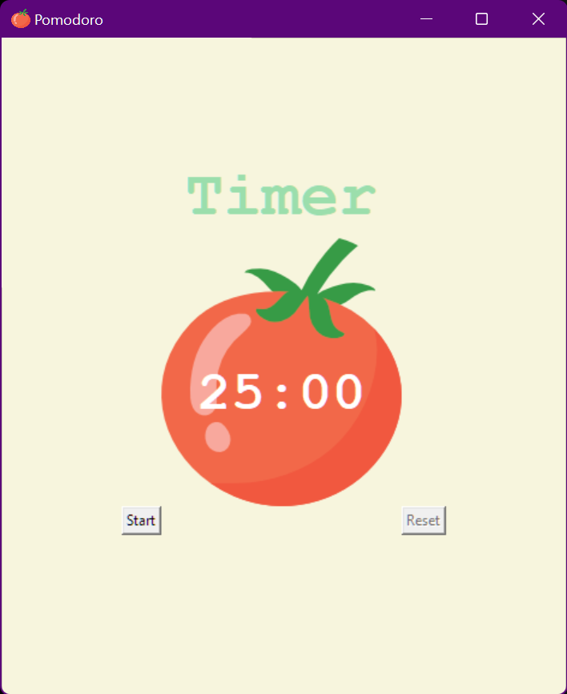

# Pomodoro

This is a [pomodoro app](https://en.wikipedia.org/wiki/Pomodoro_Technique) using the Python Tkinter module.

To run the app, clone the repository and run `main.py` using python from the command line. You will need to have `tomato.png` in the same directory as `main.py` in order to display the app correctly.

Happy studying!
